# docker images
for a college we had to make a k3s clusters with multiple different services like prometheus, grafana, GLPI and grafana. During the class I got stressed and kind of forgot i knew how to use docker so i searched online for images of every service. The project was succesful but there was a small problem. The last part was to use a security tool to scan for vulnerabilities and fix them. Since the images werent mines i had to do so much research to fix them. the security tools was trivy cause it was free. But This time i wanted to try and make all of my images myself and maybe later ill do a trivy scan and show you how to fix vulnerabilities but today ill show you some of the images i made.

## Grafana
i assume you all know how to use docker but before we start you must have docker and docker compose installed. also every will ubuntu cause i am used to the OS. This is an images of my file

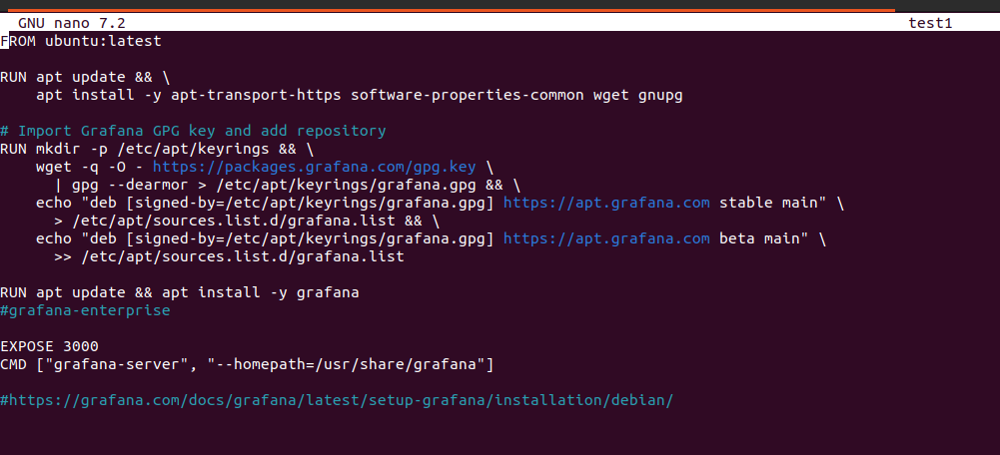
the link at the bottom of the file is a a guide to install grafana on ubuntu. i just modified some part to make it work in docker.<br> I will make an image named grafana<br><br>

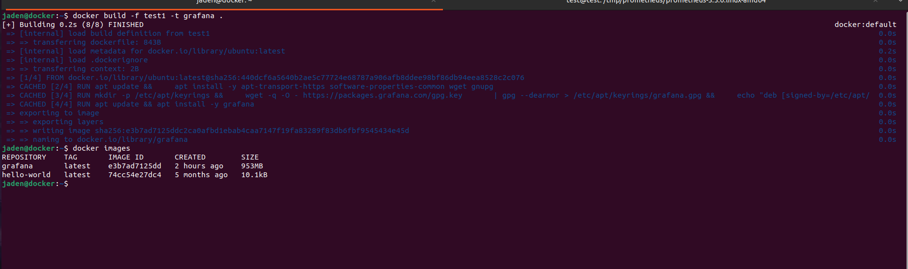
the dockerfile name is test1 and the image in my local docker is grafana.<br> Now i will just run the command to make a container and show you the functionnal grafana.<br>

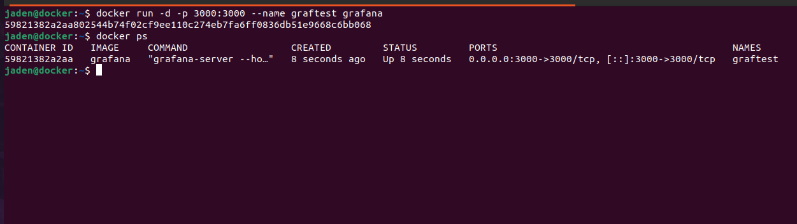<br><br>
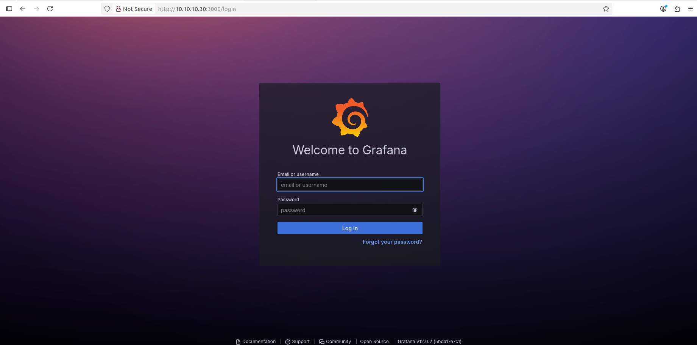<br> enter admin and admin for both <br><br>
<br><br>
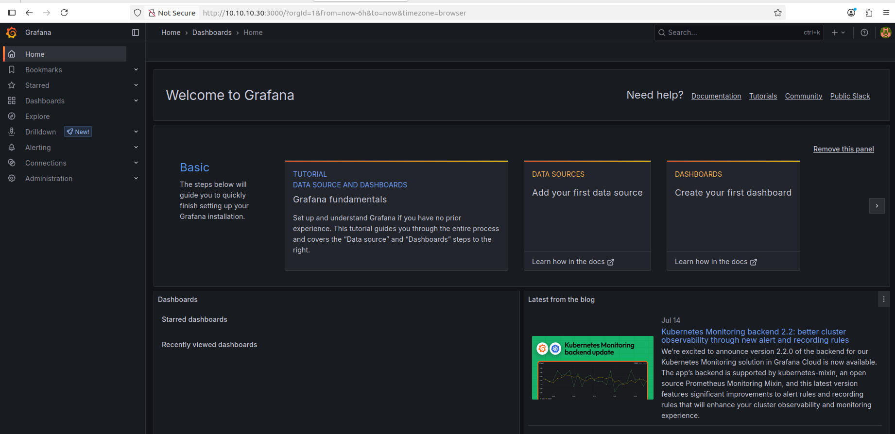
This should prove our image works.

## prometheus
This one is harder i couldn't just follow a guide like grafana cause there are some commands liky systemd that doesnt work in docker so it looks a little different but i tried to make it a simple as possible.


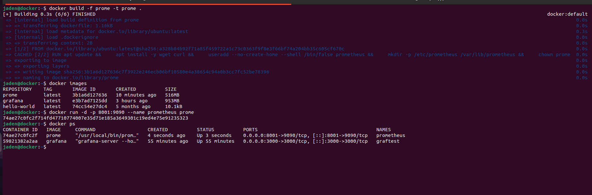

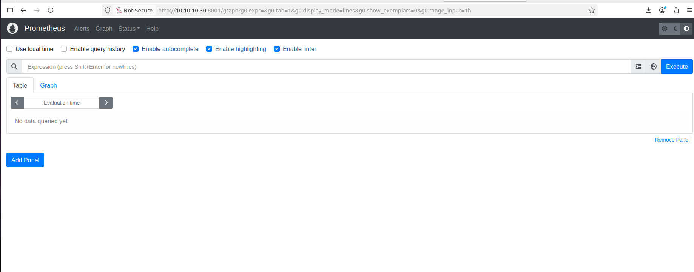

# mysql and glpi

this part is a little easier but first i will show the glpi file then i will show you my docker compose file. the mysql file you can just take from the official stie to make it easier but let me show you how i did it.


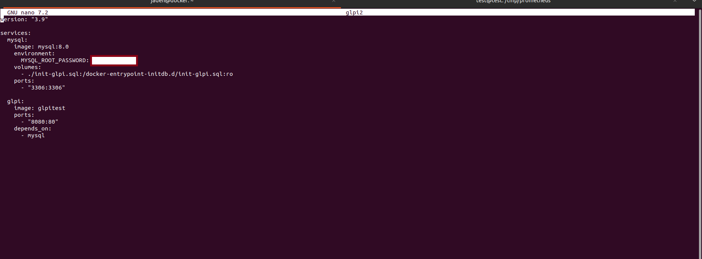
this is my docker compose file where i will make my 2 containers for both services

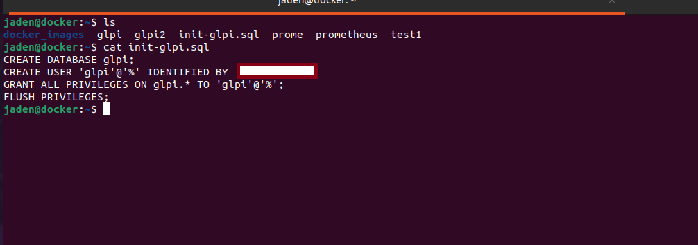
this is a file where i make my user for my database. i am pretty sure you can make it in the dockercompse file but ill stick with what i did.

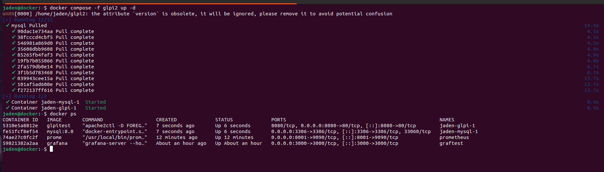
i just made my 2 containers for each services

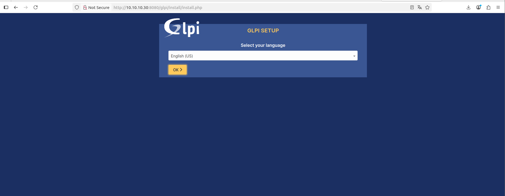
When i go on the correct port i should see something like this 

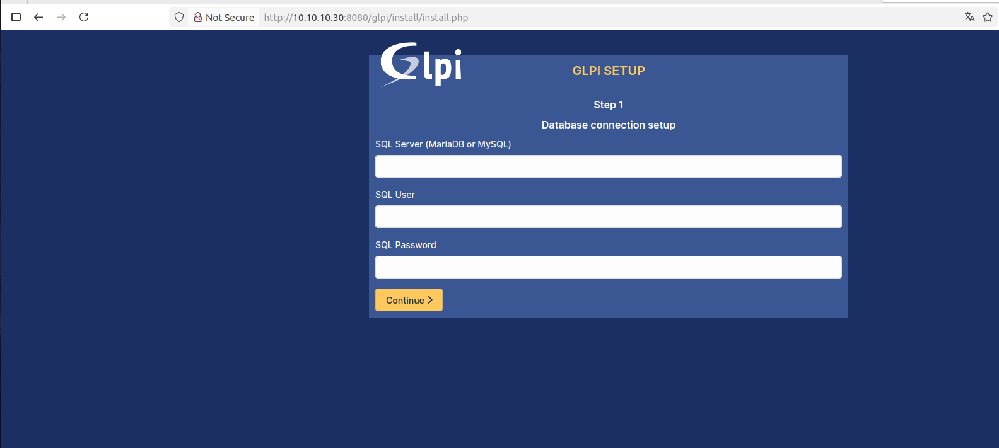
here i enter the information of my database like the ip and port the user glpi and its password

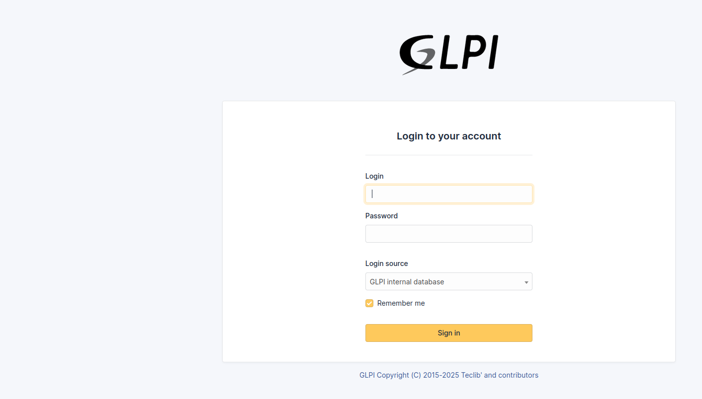
and then there is glpi that is connected to a external database. the main login is glpi and glpi.

in the future I want to use atleast the glpi grafana and maybe prometheus images for my kubernetes cluster.

### save the images
To save these images i uses this dockersave command to save each image

```bash
docker save -o glpitest.tar glpitest
docker save -o prome.tar prome
docker save -o grafana.tar grafana
docker save -o mysql.tar mysql:8.0
```
